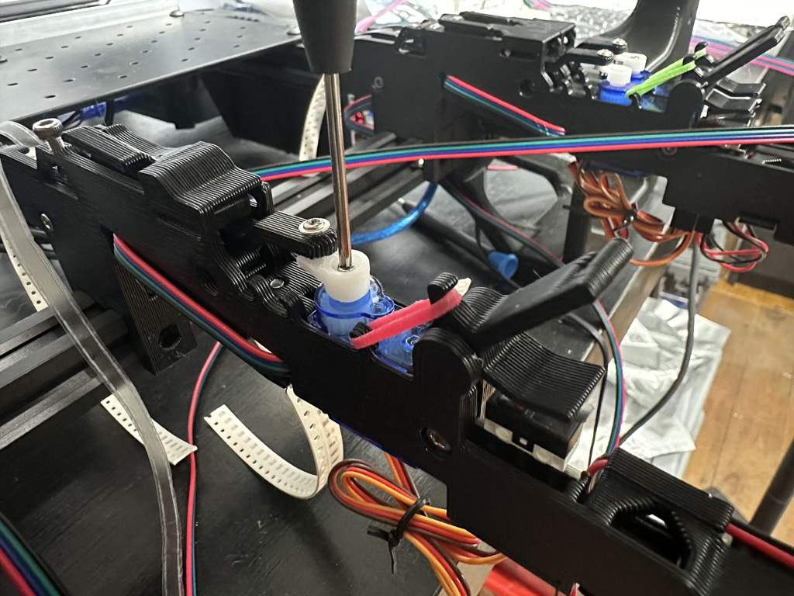

# Finishing Assembling the Max Feeder

You will need the following components to finish assembling the Max Feeder

- Servo poker arm
- Max Feeder PCB
- Motor installed in Feeder Base
- 5x M3 6mm screws
- 2x M3 20mm screws
- Replacement Pen Spring
- Latex free Orthodontic Elastic band
- FeederCover 3D print
- LeafSpingHeavy 3D print
- PressureArm 3D print
- PressureArmWasher-0.4mm-nozzle 3D print
- TapeLever 3D print
- Wedge 3D print - optional
- T-nut - optional

Don't want to source all these parts?
[Buy the kit!](https://store.curlytalegames.com/pages/max-feeders)

## Instructions

Push the leaf spring into the slot on the Feeder Base

Push the servo arm assembly into the slot on the Feeder Base

Screw the servo into the Feeder Base

Position the pressure arm onto the feeder base like shown

Slide the pen spring onto the M3 20mm screw, and then slide the pressure arm washer 3D print on top of that. The washer will allow the spring to slide without getting stuck.

Screw the M3 20mm screw into the Feeder Base as shown. Only screw it in a few millimeters, the sping should be able to still move.

Test to make sure the spring can compress and the pressure arm can move.

There is a slot for the Max Feeder PCB to slide into. Push it into place, but be careful not to press on the wires, they can be easily pulled out at this point.

Wrap the wires from the PCB around the strain reliefs.

Plug the servo and motor into the angled header on the bottom of the PCB. The brown wire on the servo goes to GND and the orange wire goes to S (for signal). The black wire on the motor should go to M- and the red wire should go to M+. 

If the cover tape ever gets jammed you can flip the motor plug to reverse the direction of the motor.

Press the Feeder Cover onto the Feeder Base. It can be tricky to line up.

Flip the feeder over and screw the 3x M3 6mm screws into the holes. Firmly hold the cover on and screw the M3 screws in all the way, but be careful not to overtighten them, you are screwing into plastic.

Slide the Tape Lever on the axel above the PCB, and using an elastic attach the lever to the closest hook on the Feeder Base as shown.

Some tapes will require a little more friction for the servo to ratchet properly. Screw a M3 6mm screw into the front of the feeder to press down slightly on the tape.

Optional - Clip the feeder onto some 2020 aluminum extrusion and using an M3 T-nut and an M3 6mm screw tighten the feeder down to the frame of your Pick and Place machine.

Optional - If you don't want to bolt the feeder down, you can screw an M3 20mm screw into the bottom of the feeder and use the 3D printed wedge to hold the feeder in place. This allows you to more easily remove or reposition the feeder.

<video src="https://user-images.githubusercontent.com/25337335/216263875-0b8626d9-b433-4cdb-8888-c90433fe03b6.mp4" data-canonical-src="https://user-images.githubusercontent.com/25337335/216263875-0b8626d9-b433-4cdb-8888-c90433fe03b6.mp4" controls="controls" muted="muted" class="d-block rounded-bottom-2 border-top width-fit" style="max-height:640px; min-height: 200px">
</video>

We want the servos to all have the same start and end position. To ensure that, unplug the servo horn from the servo, plug the JST cable into the Max Feeder Shield, and touble click the tape lever to actuate the servo.

Now re-attach the servo horn facing straight towards the front of the feeder.

Using the tiny screw included in the servo horn kit, screw the servo horn onto the servo.

### [Next Step: GcodeDriver and AutoFeeder Setup in Open PnP](openpnp.md)
