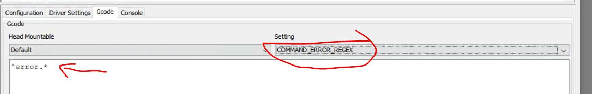
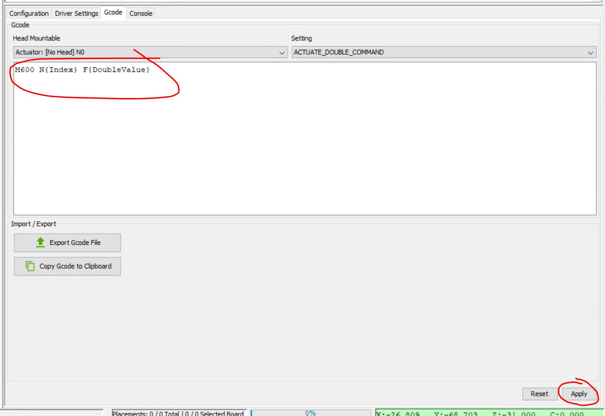

# Max Feeder Open PnP AutoFeeder Configuration

You will need at least 1 Max Feeder, and Max Feeder Shield assembled and connected to your computer. As well as Open PnP installed and your pick and place machine configured.

Need the parts to assemble some Max Feeders? [Buy the kit!](https://store.curlytalegames.com/pages/max-feeders)

## Instructions


Go to the Machine Setup tab select Drivers and click the + button to add a new Driver.


Select GcodeDriver and click Accept


Rename the driver to MaxFeeder, set the communications type to serial

Select the COM port of the Max Feeder, and set the baud rate and other serial settings to match the screenshot above.

Click Apply.


Each feeder is set up as an Actuator in Open PnP. Select "Actuators" from the Machine Setup window, and then click the + button to add a new Actuator.


Select ReferenceActuator, and then click Accept.


Set the Driver of the new Actuator to use the MaxFeeder GcodeDriver. Name the Actuator N0 for feeder index 0. Increment this value up for each feeder you create.

In the "General" actuator settings set the Value Type to "Double", and the "ON Value" to 4.0

This is the amount of mm you want the feeder to advance based on the size of your part. For 8mm tape you typically want this to be 4mm.

Set the Enabled state to LeaveAsIs

Set the Index to match the index of the feeder. So if this is the first feeder you'd set it to 0.

Click Apply.


Select the MaxFeeder Gcode Driver and go to the Gcode tab.

Select Default, and then under Setting select `COMMAND_CONFIRM_REGEX`

Copy and paste this Regex:
```
^ok.*
```
Click Apply

This reads the confirmation gcode that the Arduino Mega will send back when it completes a command.



Select `COMMAND_ERROR_REGEX` and copy and paste in this Regex:
```
^error.*
```

Click Apply


Now let's set up the Gcode for a feeder.

Select the actuator you just created, this one is called N0


Select `ACTUATE_DOUBLE_COMMAND` in the Setting dropdown



Enter this Regex:
```
M600 N{Index} F{DoubleValue}
```

Click Apply

You will use the same regex for all of your Max Feeders/Actuators in Open PnP.

Here is an explaination of what each part of the command is.

| Gcode  | Meaning |
| ------------- | ------------- |
| `M600`  | Move command for the servo  |
| `N{Index}`  | index of the feeder you want to move. The `{Index}` will use the index you set in the Actuator  |
| `F{DoubleValue}`  | The distance in mm to move the tape forward, it gets this value from the `Double value` you set in the feeder later   |

For our feeder the final Gcode that gets sent would be:
```
M600 N0 F4
```

## Creating the AutoFeeders


In the `Feeders` tab, click the + button to add a new feeder.


Select ReferenceAutoFeeder, and click Accept.


Select the part you want to assign to the feeder.

Move the tip of the pick and place nozzle directly on top of the first fully exposed part on the Max Feeder. Click the Capture Tool Position button to get the position of the part on your pick and place machine.

Set the Actuator to use `N0`, the name of the actuator that is controlling that feeder.

Set the Actuator Value to 4. Most 8mm tape parts use a feeding distance of 4mm, but if the part you are feeding requires something else you can enter that there.

Click the Apply button.

Once the tape is loaded you can test feeding parts by pressing the `Test feed` button.

## [Next Step: Loading and Unloading Tape](tape.md)
