# Max Feeder PCB Assembly

You will need the following components to assemble the Max Feeder PCB

- Max Feeder PCB
- SPDT Microswitch
- Diode
- 5 pin 2.54mm Angled Male Header
- 4 Pin JST cable ("Stepper Motor" Cable)

Don't want to source all these parts?
[Buy the kit!](https://store.curlytalegames.com/pages/max-feeders)
## Instructions

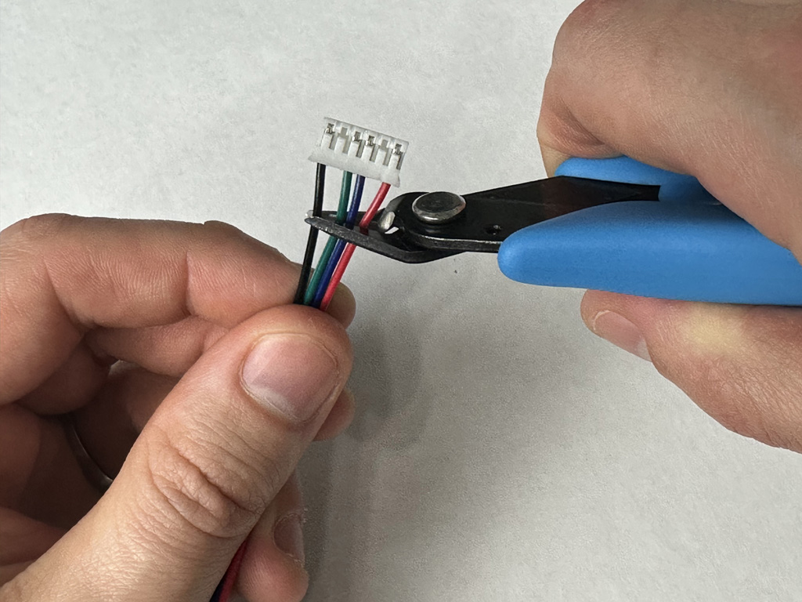
Cut off the 6 pin end from the 4 pin JST cable

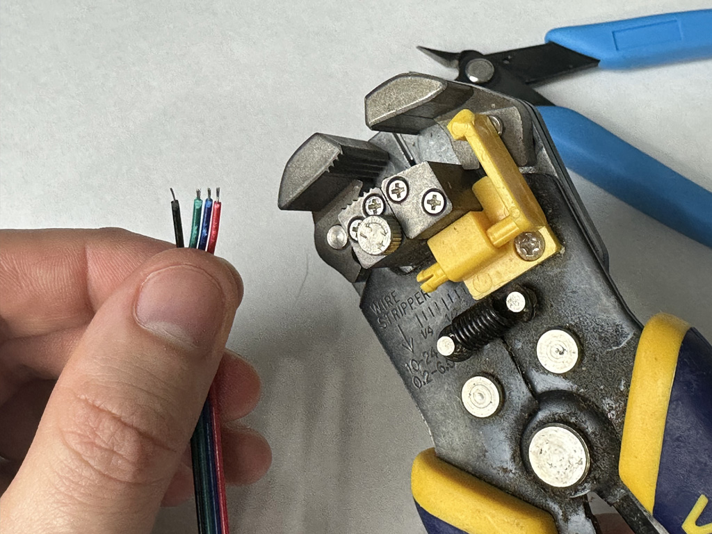
Strip a few millimeters of insulation off the wires

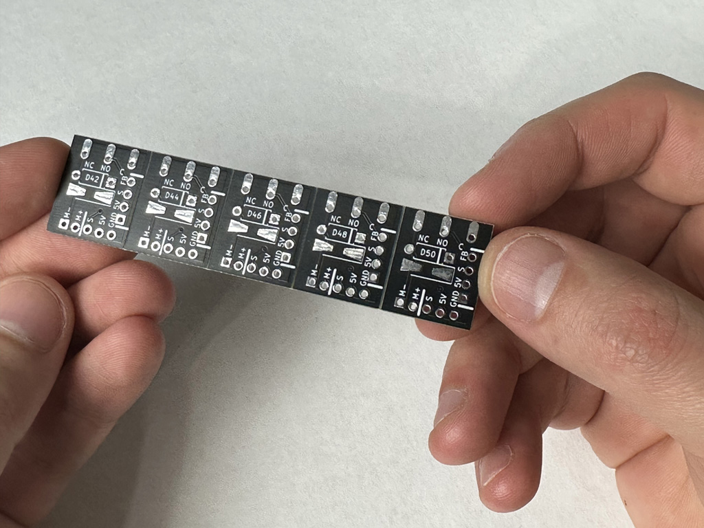
The Max Feeder PCBs are V-cut into strips

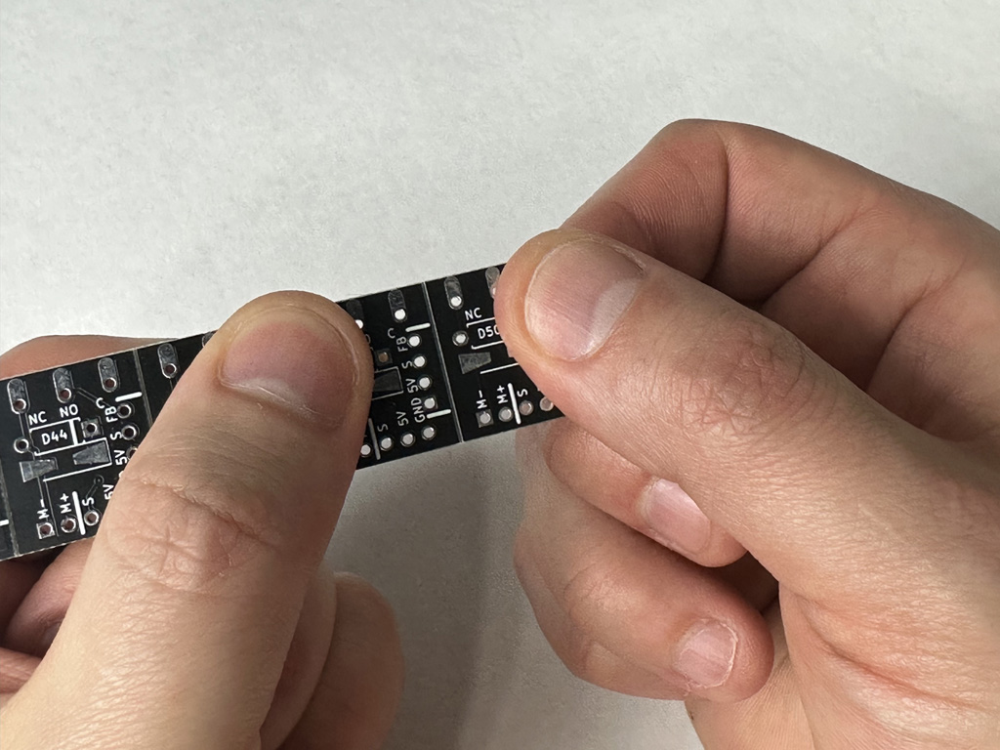
Snap off a single Max Feeder PCB

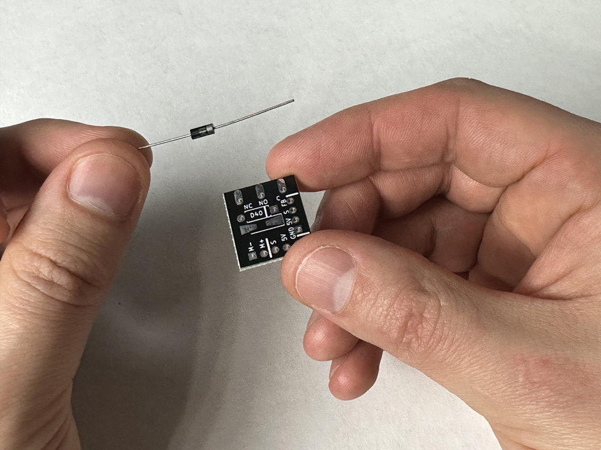
Grab a diode

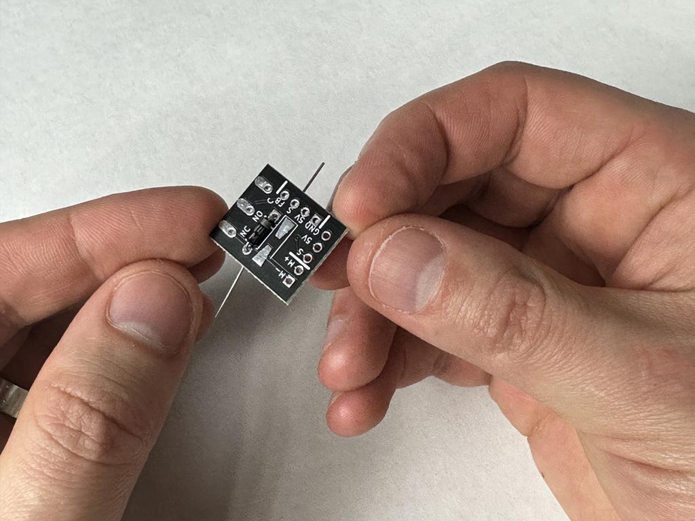
Insert the diode into the PCB as shown

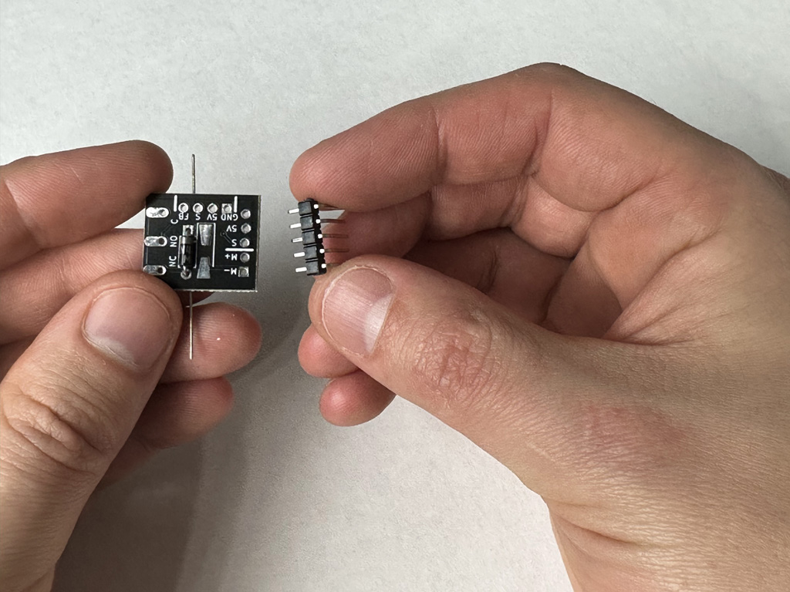
Grab a 5 pin 2.54mm angled header

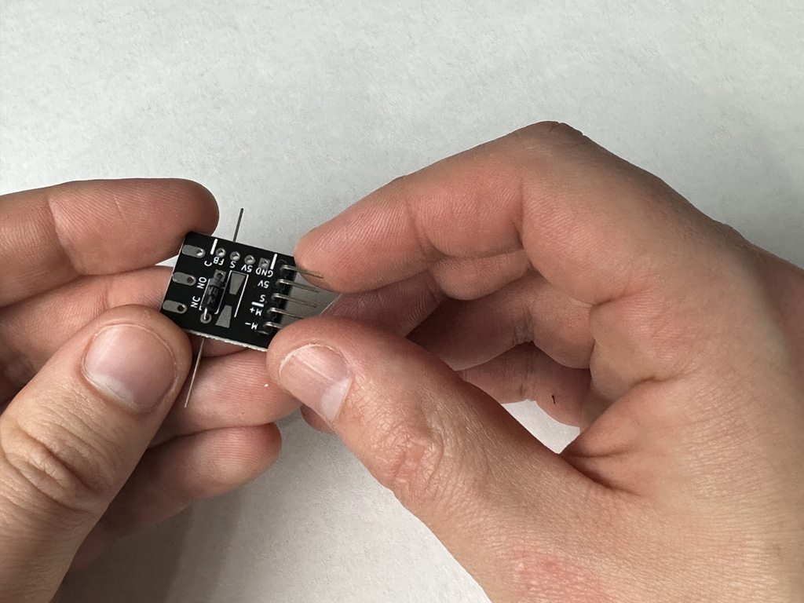
Insert the angled header as shown

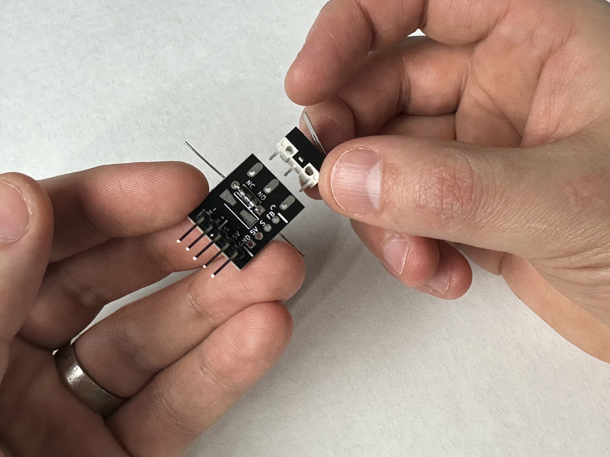
Grab a SPDT microswitch

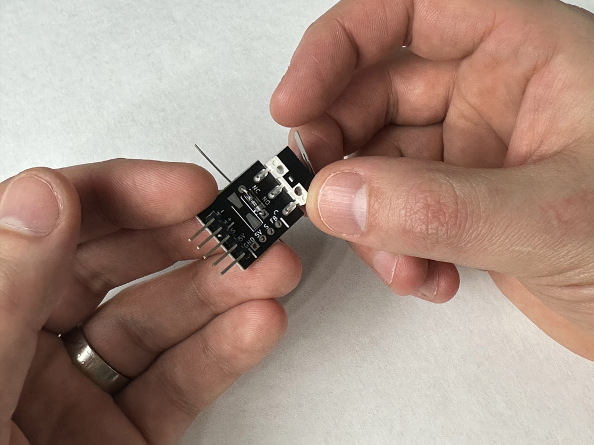
Line up the switch with the pads as shown

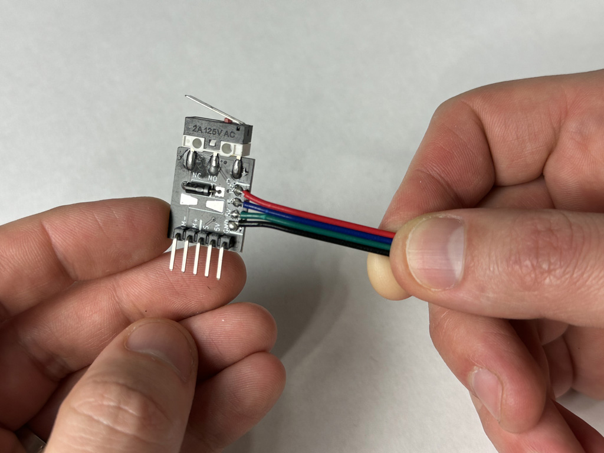
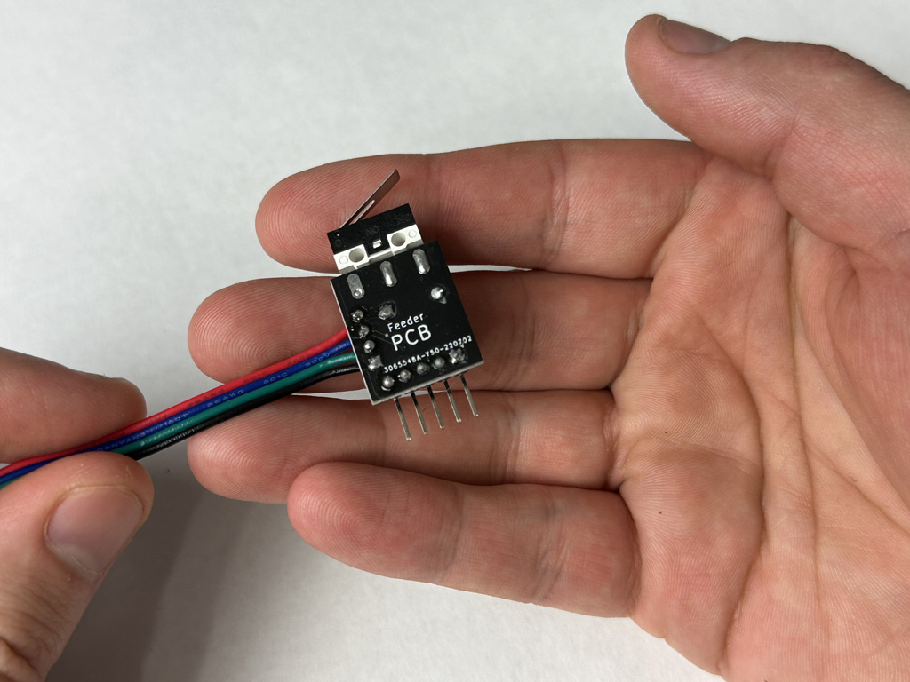
Solder the diode, switch, header, and cable to the PCB

Repeat these steps to assemble all of your Max Feeder PCBs.

### [Next Step: Servo Poker Assembly](poker.md)

