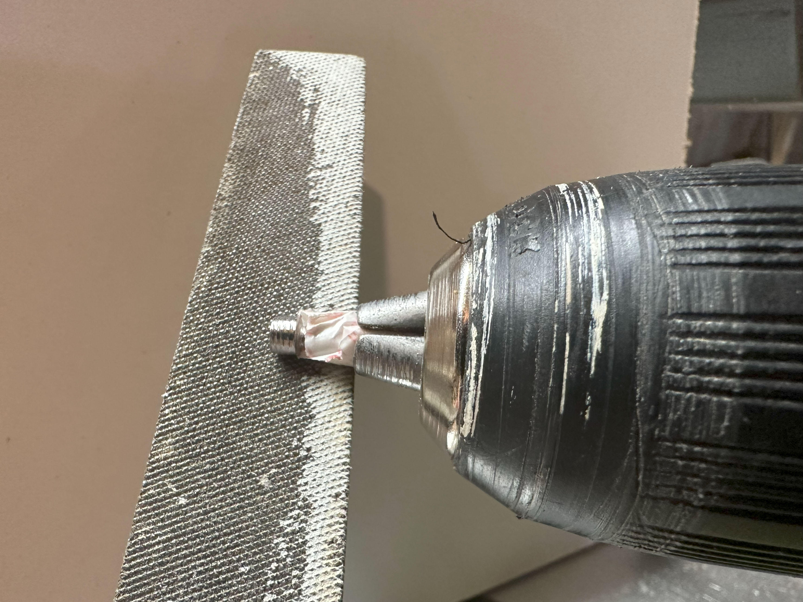

# Max Feeder Troubleshooting Guide

## The n20 Won't Stop Spinning / My Max Feeders Aren't Actuating

The n20 motor will spin if you don't have tape loaded into the feeder.

The microswitch is what controls the motor, when it's pressed down it cuts power to the motor, and sends a signal to the Arduino Mega letting it know that the slack tape has been pulled through the gears.

The firmware on the Arduino Mega sends an `ok` message over serial when the microswitch is pressed. This lets Open PnP know the feeding was successful. Open PnP won't let you feed more parts until it gets an `ok`.

To fix these problems you can either unplug feeders you aren't using, or what I like to do is wedge some 0.1" male header under the tape lever like this:

## Servo Not Ratcheting Tape

There can be a few reasons why the tape isn't being pushed forward. Here a few things to check:

* Make sure The tip of the poker is sharp and pointy. Cut it with a sharp fresh knife blade. This should not be an issue with the new PCB poker tips.
* If the tape moves back and forth when the servo actuates, make sure to tighten the screw on the top front of the Max Feeder to put pressure on the tape.
* If the servo actuates but the tape doesn't move, loosen the screw on the top front of the Max Feeder.
* If you are rough with the cable soldered to the PCB sometimes one of the wires might break and get disconnected or have intermitten connections. If you resolder the wires to the PCB it should fix the issue. Usually this isn't an issue unless you take your feeders apart and put them back together a bunch.

## Tape Gears Binding

There are a couple things that could bind the gears, here are a few things that have happened and how to fix it.

### Loose Part Jammed in Gears
After doing a lot of test feeds I had a 0805 resistor get stuck to the adhesive on the cover tape. The resistor somehow made it all the way back to the tape gears and jammed them. Unscrew the idler gear and pull out the n20 motor to remove the loose part. Under normal opperation this wouldn't happen. The pick and place machine would pick up the part so you wouldn't have loose parts.

### Excessive Pressure on Idler Gear

One user reported that the M3 20mm screw was putting exessive pressure on the idler gear causing the motor to bind. In order for the gears to hold the tape, the M3 20mm screw needs to be very close to the n20 motor. It's normal for the head of the M3 20mm screw to scrape on the side of the motor, but the gears should be able to turn.

What fixed it was filing down the head of the screw. Wrap the threads of the screw with some tape, and put it in a drill chuck and press it against the file. 

Alternatively an M3 20mm grub screw could also be used.

